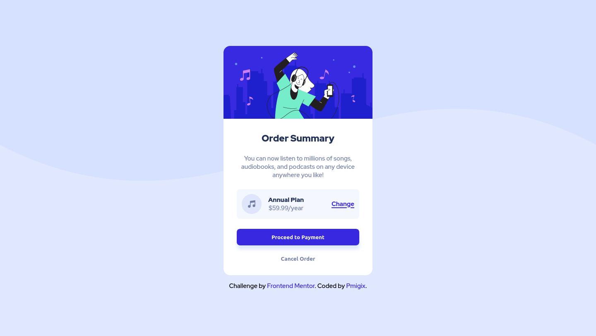
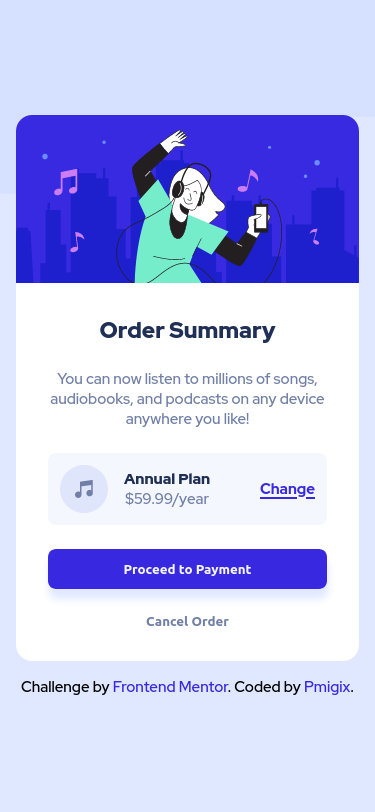

# Frontend Mentor - Order summary card solution

This is a solution to the [Order summary card challenge on Frontend Mentor](https://www.frontendmentor.io/challenges/order-summary-component-QlPmajDUj). Frontend Mentor challenges help you improve your coding skills by building realistic projects. 

## Overview

### The challenge

Users should be able to:

- See hover states for interactive elements

### Screenshots

### Links

- Live Site URL: https://pmigix.github.io/order-summary

### Built with

- CSS custom properties
- Flexbox

## Author

- Frontend Mentor - [@pmigix](https://www.frontendmentor.io/profile/pmigix)